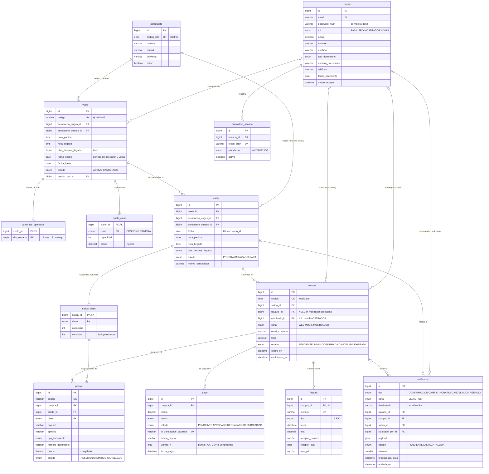

# AeroNet — Modelo de datos (US 2)

Modelo relacional de AeroNet en **MariaDB** (probado en 11.4 LTS; requiere ≥ 10.6 por `JSON_TABLE`).
SQL puro, sin ORM.

| Archivo | Contenido |
|---|---|
| [db/01_schema.sql](../db/01_schema.sql) | Base, tablas, PK/FK/UNIQUE/CHECK, índices y vistas |
| [db/02_logic.sql](../db/02_logic.sql) | Triggers, procedimientos almacenados y evento programado |
| [db/03_seed.sql](../db/03_seed.sql) | Datos de prueba (10 aeropuertos, 4 vuelos, 6 usuarios, 7 compras) |
| [db/04_tests.sql](../db/04_tests.sql) | 26 casos que verifican restricciones y lógica |
| [docker-compose.yml](../docker-compose.yml) | MariaDB que carga 01 → 02 → 03 al crear el volumen |

```bash
docker compose up -d                  # crea la base y carga 01..03
docker compose exec db sh -c 'mariadb -uroot -p"$MARIADB_ROOT_PASSWORD" aeronet < /aeronet/db/04_tests.sql'
docker compose down -v                # borra el volumen (la próxima vez recarga los scripts)
```

`04_tests.sql` corre dentro de una transacción que se deshace al final: no deja datos y se puede
repetir. Termina con código de salida ≠ 0 si algún caso falla, así que sirve para CI.

> **Para usar la base** (conexión, datos de prueba, recetas SQL por funcionalidad, errores,
> problemas frecuentes) ver el [manual de uso](manual-base-de-datos.md). Este documento explica
> el diseño.

---

## 1. Diagrama entidad-relación



Todas las tablas tienen además `created_at` y `updated_at` (`ON UPDATE CURRENT_TIMESTAMP`),
omitidos en el diagrama por legibilidad.

---

## 2. Tablas

### Catálogo y usuarios

**`aeropuerto`**: aeropuertos donde opera la aerolínea. `codigo_iata` es único y tiene un CHECK
que exige 3 letras mayúsculas. Tiene índice por `ciudad` porque la búsqueda puede ser por ciudad.
Se deshabilita con `activo`.

**`usuario`**: pasajeros registrados y cuentas internas en una sola tabla, con `rol`
(`PASAJERO`, `MOSTRADOR`, `ADMIN`).
- `email` es único y la colación es *case-insensitive*, así que `Ana@x.com` y `ana@x.com` colisionan.
- `password_hash` tiene un CHECK que solo acepta formato bcrypt (`$2a$/$2b$/$2y$`) o argon2, así
  que una contraseña en claro no se puede guardar.
- `activo` permite deshabilitar una cuenta sin borrarla.
- El documento es opcional, pero si se informa, el par tipo + número es único.

**`dispositivo_usuario`**: tokens push de la app móvil (`ANDROID`/`IOS`). El token es único; un
usuario puede tener varios dispositivos.

### Vuelos

**`vuelo`**: la definición recurrente que crea el admin: código, ruta, horario de partida y
llegada, `dias_desfase_llegada` (0 o 1), período (`fecha_desde`–`fecha_hasta`) y estado.
Restricciones:
- CHECK de origen ≠ destino.
- CHECK de desde ≤ hasta.
- Si la llegada es el mismo día, la hora de llegada tiene que ser posterior a la de partida.

**`vuelo_dia_operacion`**: días de la semana en que opera el vuelo (`1` = lunes … `7` = domingo,
con CHECK). Es configuración, por eso es la única tabla de vuelos que admite borrado físico.

**`vuelo_clase`**: capacidad y **precio vigente** por clase (`ECONOMY`, `PRIMERA`). La
capacidad y el precio tienen que ser mayores que 0. Un vuelo sin Primera simplemente no tiene esa fila.

**`salida`**: cada ocurrencia del vuelo en una fecha concreta. La crea `generar_salidas()`.
- Única por `(vuelo_id, fecha)`.
- Copia la ruta del vuelo para la búsqueda indexada y el horario porque es modificable por salida.
- Tiene su propio estado (`PROGRAMADA`, `CANCELADA`) y motivo de cancelación.

**`salida_clase`**: capacidad y asientos `vendidos` por salida y clase.
`CHECK (vendidos >= 0 AND vendidos <= capacidad)`. Es la fila que se bloquea y actualiza al vender.

### Venta

**`compra`**: una transacción de venta sobre **una** salida.
- `codigo` es un localizador de 6 caracteres que genera el trigger.
- `usuario_id` es el comprador; es `NULL` en ventas de mostrador sin cuenta.
- `empleado_id` es el empleado vendedor. Un CHECK lo exige solo si el canal es `MOSTRADOR`.
- También guarda `canal`, `email_contacto` (obligatorio), `total`, `estado`, `expira_en` y
  `confirmada_en`.

**`pasaje`**: un asiento para una persona.
- Guarda los datos del viajero (nombre, apellido, tipo y número de documento): los acompañantes no son usuarios.
- Guarda también la clase, el **precio congelado** al momento de la compra, un código único y el estado.
- Tiene dos FK compuestas:
  - `(compra_id, salida_id) → compra(id, salida_id)`: el pasaje es de la misma salida que su compra.
  - `(salida_id, clase) → salida_clase`: la salida ofrece esa clase.

**`pago`**: resultado de la pasarela o del cobro en mostrador.
- Solo guarda `ultimos_4` y `marca_tarjeta`: **nunca** número de tarjeta, CVV ni vencimiento
  (no hay columnas para eso).
- Los CHECK exigen `ultimos_4` e id de transacción para pagos con tarjeta, y los prohíben para
  efectivo y transferencia.
- `id_transaccion_pasarela` es único, lo que también da idempotencia ante *webhooks* repetidos.

**`factura`**: comprobante de una compra confirmada. Una por compra.
- El número es único; el tipo es `A`, `B` o `C`; guarda fecha, total, receptor y `ruta_pdf`.
- La factura A exige CUIT del receptor.
- Un trigger exige que la compra esté `CONFIRMADA` y que el total coincida.

### Notificaciones

**`notificacion`**: *outbox* de emails y push.
- Guarda `tipo`, `canal`, `destinatario` (email o token), referencia a compra y/o salida (CHECK:
  al menos una), `payload` JSON con los datos para la plantilla, `estado`, `intentos`,
  `ultimo_error`, `programada_para` (para reintentos con *backoff*) y `enviada_en`.
- El índice `(estado, programada_para)` es la cola del *worker*.

### Vistas

- **`v_disponibilidad`**: salidas vendibles (programadas, de vuelo activo, en el futuro) con precio
  vigente y asientos disponibles por clase. Es la base de la búsqueda de pasajeros.
- **`v_ocupacion`**: por vuelo, fecha y clase muestra capacidad, `vendidos` (incluye reservas),
  `emitidos` (pagados), `reservados`, disponibles, % de ocupación y recaudación. Es la base de los reportes.

---

## 3. Lógica en la base de datos

### Procedimientos

| Procedimiento | Qué hace |
|---|---|
| `generar_salidas(vuelo_id)` | Crea una `salida` por cada día de operación dentro del período y su `salida_clase` por clase. Es **idempotente**: se vuelve a llamar después de extender el período, agregar días o agregar una clase. |
| `reservar_asientos(salida_id, clase, n)` | Reserva atómica: `UPDATE salida_clase SET vendidos = vendidos + n WHERE … AND vendidos + n <= capacidad`. Si afecta 0 filas, aborta con un mensaje que distingue entre "sin disponibilidad" y "salida no vendible". |
| `crear_compra(salida, usuario, empleado, canal, email, pasajeros_json, OUT compra_id)` | Flujo completo de venta: valida de 1 a 9 pasajeros, crea la compra `PENDIENTE_PAGO`, reserva asientos por clase, inserta los pasajes con el precio vigente y calcula el total. Es todo o nada. |
| `registrar_pago(compra, monto, medio, estado, id_tx, marca, ultimos_4, OUT pago_id, OUT resultado)` | Registra el pago y aplica su efecto. `APROBADO` confirma la compra (emite pasajes y encola la `CONFIRMACION`). `RECHAZADO` la cancela (libera asientos). Un pago aprobado sobre una compra ya vencida se registra igual y devuelve `REQUIERE_REEMBOLSO`. |
| `liberar_reservas_vencidas()` | Pasa a `EXPIRADA` las compras `PENDIENTE_PAGO` con `expira_en` vencido. Los triggers cancelan sus pasajes y devuelven los asientos. Devuelve cuántas compras y asientos liberó. |
| `reenviar_documentacion(compra, solicitante, email)` | Encola un `REENVIO` de pasajes y factura (por ejemplo, pedido en mostrador). |

Los procedimientos de varios pasos abren su propia transacción si se los llama en modo
*autocommit*, o usan un `SAVEPOINT` si el backend ya abrió una. Ante cualquier error deshacen lo
suyo y re-lanzan el error original.

**Evento `ev_liberar_reservas_vencidas`**: ejecuta `liberar_reservas_vencidas()` cada minuto.
Requiere `event_scheduler=ON`, que el `docker-compose.yml` ya activa.

### Invariante de capacidad

Para cada salida y clase se cumple:

```
pasajes activos (RESERVADO + EMITIDO)  ≤  vendidos  ≤  capacidad
```

| Parte | Quién la garantiza |
|---|---|
| `vendidos ≤ capacidad` | `CHECK chk_salida_clase_vendidos` |
| `vendidos` solo sube de forma atómica | `reservar_asientos()` (UPDATE condicional; el bloqueo de fila de InnoDB serializa ventas concurrentes) |
| `pasajes activos ≤ vendidos` | `trg_pasaje_bi`: un pasaje insertado "a mano" sin reservar el asiento se rechaza |
| `vendidos` baja al cancelar un pasaje | `trg_pasaje_au`, **único** punto de liberación: lo disparan la expiración, el pago rechazado, la cancelación de la compra y la cancelación individual |
| capacidad nunca `< vendidos` | `trg_salida_clase_bu` (mensaje claro) + el CHECK |

Así la integridad no depende de que el backend use los procedimientos: un INSERT o UPDATE directo
que la viole también se rechaza. Se verificó con 25 reservas concurrentes sobre 12 asientos:
exactamente 12 aceptadas y 13 rechazadas.

### Triggers

| Tabla | Trigger | Regla |
|---|---|---|
| `vuelo` | `bu` | Un vuelo cancelado no se reactiva. La ruta no se modifica. |
| `vuelo` | `au` | La cancelación y el cambio de horario se propagan a las salidas **futuras** (ver decisión 13). |
| `vuelo_clase` | `au` | Un cambio de capacidad se propaga a las salidas futuras. Si alguna quedaría por debajo de lo vendido, se aborta el UPDATE completo. |
| `salida` | `bu` | Una salida cancelada no se reprograma. `vuelo_id` y `fecha` son inmutables. |
| `salida` | `au` | Ante cancelación o cambio de horario, encola notificaciones (email por compra activa + push por dispositivo del comprador). Al cancelar, también cancela las compras aún impagas. |
| `salida_clase` | `bu` | La capacidad no puede quedar por debajo de `vendidos`. |
| `compra` | `bi` | Nace en `PENDIENTE_PAGO`, sobre una salida vendible. Valida comprador y empleado (activo y con rol interno). Genera el localizador. `expira_en` por defecto es +15 min. |
| `compra` | `bu` | Máquina de estados: `PENDIENTE_PAGO → CONFIRMADA / CANCELADA / EXPIRADA` y `CONFIRMADA → CANCELADA`. Los estados finales no se reabren. |
| `compra` | `au` | `CONFIRMADA` emite los pasajes. `CANCELADA` o `EXPIRADA` los cancela. |
| `pasaje` | `bi` | Hasta 9 por compra. Solo en compras pendientes. Exige asiento reservado. Congela el precio si no viene. Genera el código. |
| `pasaje` | `bu` | Compra, salida, clase, precio y código son inmutables. Transiciones: `RESERVADO → EMITIDO / CANCELADO` y `EMITIDO → CANCELADO`. |
| `pasaje` | `au` | Al cancelar, devuelve el asiento (`vendidos - 1`). |
| `factura` | `bi` / `bu` | Solo se factura una compra confirmada, con su total. Una vez emitida, solo se puede completar `ruta_pdf`. |
| aeropuerto, usuario, vuelo, vuelo_clase, salida, salida_clase, compra, pasaje, pago, factura | `bd` | Borrado físico bloqueado (borrado lógico). |

---

## 4. Decisiones de diseño

1. **Vuelo vs. salida.** `vuelo` es la definición recurrente y `salida` es cada ocurrencia, que
   se **materializa** al crear el vuelo. La venta, la capacidad, las cancelaciones puntuales, los
   reportes y las notificaciones trabajan sobre `salida`. Calcular las ocurrencias "al vuelo"
   impediría guardar la capacidad vendida, cancelar un día puntual o reportar por fecha.

2. **Interpretación del "período del año en que está disponible para la venta".** Se interpreta
   como **el rango de fechas en que el vuelo opera y se vende** (`fecha_desde`–`fecha_hasta`, con
   CHECK desde ≤ hasta). Solo existen salidas dentro de ese rango, y cada una se puede vender hasta
   su hora de partida.
   *Alternativa descartada:* separar "ventana de venta" de "período de operación" (por ejemplo,
   vender en marzo los vuelos de julio). Si el negocio lo necesitara, se agregan
   `venta_desde`/`venta_hasta` a `vuelo` sin romper nada.

3. **Días de operación en tabla aparte** (`vuelo_dia_operacion`, `TINYINT 1–7` con CHECK) y no
   como `SET`. Es indexable, se consulta y se une con SQL estándar, y agregar o quitar un día es
   un INSERT o un DELETE.

4. **Capacidad y precio por clase** en `vuelo_clase` (vigente) y `salida_clase` (capacidad y
   vendidos por salida). La capacidad se copia a la salida para poder ajustarla por fecha (por
   ejemplo, un cambio de aeronave) sin tocar el vuelo.

5. **Llegada al día siguiente** con `dias_desfase_llegada` (0 o 1) junto a las horas. Con desfase
   0, un CHECK exige llegada posterior a la partida.

6. **Reserva atómica** con UPDATE condicional sobre `salida_clase`, sin `SELECT … FOR UPDATE`
   previo. Es una sola sentencia y el bloqueo de fila de InnoDB serializa las ventas concurrentes
   de la misma salida y clase.

7. **La reserva temporal cuenta en `vendidos`.** Una compra `PENDIENTE_PAGO` ya ocupa su asiento
   (así no se sobrevende mientras el pasajero paga) y vence a los **15 minutos**. Se libera al
   expirar (evento cada minuto), al cancelar o si el pago se rechaza.

8. **Precio congelado** en `pasaje.precio`. `vuelo_clase.precio` es el precio vigente y puede
   cambiar sin afectar lo ya vendido. `compra.total` es la suma de sus pasajes.

9. **Ruta copiada en `salida`** (`aeropuerto_origen_id`, `aeropuerto_destino_id`). Permite el
   índice `(origen, destino, fecha)` para la búsqueda sin unir con `vuelo`. La consistencia la
   garantiza una **FK compuesta** `salida(vuelo_id, origen, destino) → vuelo(id, origen, destino)`,
   no el código de la aplicación.

10. **`salida_id` en `pasaje`**, también con FK compuesta hacia `compra`. Permite referenciar
    `salida_clase` (la clase tiene que existir en esa salida) y contar la ocupación por
    `(salida, clase)` con un índice.

11. **La ruta de un vuelo es inmutable.** Cambiar origen o destino con pasajes vendidos equivale a
    otro vuelo: se cancela y se crea uno nuevo.

12. **Cambios de capacidad** del vuelo se propagan solo a salidas futuras programadas. Si alguna
    ya vendió más que la nueva capacidad, se rechaza el cambio completo.

13. **Cambios de horario** del vuelo se propagan solo a salidas futuras que **conservan el horario
    anterior**. Una salida reprogramada individualmente (una demora puntual) no se pisa.

14. **Cancelaciones.** Cancelar un vuelo cancela sus salidas futuras. Cancelar una salida encola
    las notificaciones y cancela las compras impagas. Las compras **confirmadas** de una salida
    cancelada quedan `CONFIRMADA`: el reembolso o la reubicación es un proceso de negocio que no
    define el enunciado (ver pendientes).

15. **Notificaciones con patrón outbox.** Se escriben en la misma transacción que el cambio que
    las origina (triggers y procedimientos), así que no hay cambio sin aviso ni aviso sin cambio.
    Un *worker* externo las envía y actualiza `estado`, `intentos` y `enviada_en`.

16. **Una compra = una salida.** Un viaje de ida y vuelta son dos compras. Es lo que pide la
    decisión tomada y simplifica la capacidad y la facturación.

17. **Estados como máquinas de estado en triggers.** Los estados finales (`EXPIRADA`,
    `CANCELADA`, `CANCELADO`) no se reabren: reabrirlos sin volver a reservar rompería el
    invariante de capacidad.

18. **Borrado lógico.** `activo` en aeropuerto, usuario y dispositivo; `estado` en el resto. Las
    tablas de negocio tienen triggers `BEFORE DELETE` que lo impiden. Las FK usan
    `ON DELETE RESTRICT` y `ON UPDATE RESTRICT`: no hace falta ninguna cascada porque nada se borra.

19. **Seguridad.**
    - `password_hash` con CHECK de formato de hash.
    - Ninguna columna para el número de tarjeta, CVV ni vencimiento.
    - El backend usa el usuario `aeronet_app`, con privilegios solo sobre la base `aeronet`.

20. **Convenciones.**
    - InnoDB y `utf8mb4_unicode_ci` fijado explícitamente (MariaDB 11.4 usa `uca1400` por defecto).
    - `DECIMAL(12,2)` para montos.
    - `BIGINT UNSIGNED` para las PK.
    - `created_at` y `updated_at` en todas las tablas.
    - Nombres en español y `snake_case`.
    - Prefijos de nombre: `uq_` (unique), `ix_` (índice), `fk_`, `chk_` y `trg_`.
    - Zona horaria del servidor: `-03:00`.

### Índices pedidos

| Consulta | Índice | Verificado con `EXPLAIN` |
|---|---|---|
| Búsqueda por origen, destino y fechas | `salida.ix_salida_busqueda (origen, destino, fecha, estado)` | `range`, *covering* |
| Compras por usuario | `compra.ix_compra_usuario (usuario_id, created_at)` | `ref` |
| Compras por email de contacto | `compra.ix_compra_email` | `ref` |
| Pasajes por documento | `pasaje.ix_pasaje_documento (numero_documento, tipo_documento)` | `ref` |
| Reportes por vuelo, fecha y clase | `salida.uq_salida_vuelo_fecha` + PK `salida_clase (salida_id, clase)` + `pasaje.ix_pasaje_ocupacion (salida_id, clase, estado)` | `range` + `eq_ref` |

### Particularidades de MariaDB encontradas al implementar

- **`INSERT … SELECT` que omite una columna `NOT NULL` sin default falla antes del trigger**
  (`ERROR 1364`), aunque un `BEFORE INSERT` la complete. `INSERT … VALUES` sí funciona.
  Por eso `compra.codigo` y `pasaje.codigo` tienen `DEFAULT ''`: el trigger genera el valor
  cuando llega vacío y un CHECK impide que quede vacío.
- **Tablas no transaccionales dentro de una transacción.** Un `ROLLBACK TO SAVEPOINT` emite un
  warning que puede tapar el error real en `GET DIAGNOSTICS`. Afectaba solo al harness de tests
  (usaba `ENGINE=MEMORY`), que ahora usa InnoDB.
- **La carga inicial de la imagen Docker corre en UTC.** El entrypoint de `mariadb` arranca el
  servidor temporal que ejecuta `db/*.sql` con `--default-time-zone=SYSTEM`, ignorando el
  `--default-time-zone=-03:00` del compose. Sin `TZ: America/Argentina/Buenos_Aires` en el
  contenedor, los `NOW()` del seed quedaban 3 horas adelantados.

No hubo que cambiar ninguna de las decisiones de diseño acordadas: todas se implementaron tal cual.

---

## 5. Trazabilidad con el backlog

> **A validar por el equipo.** El backlog no está en el repositorio, así que la numeración de US 3
> a US 20 de esta tabla es **una propuesta**, derivada de los requisitos del enunciado en su orden.
> Lo que importa es la columna de requisito; si la numeración real difiere, se renumera sin cambiar
> el resto. La única referencia en el repo es el commit "Beta US4", que implementa acceso por rol.

| US (propuesta) | Requisito | Entidades | Soporte en la base |
|---|---|---|---|
| US 3 | Registro de pasajero | `usuario` | email único, hash obligatorio, rol `PASAJERO` |
| US 4 | Inicio de sesión y acceso por rol | `usuario` | `rol`, `activo`, `ultimo_acceso` |
| US 5 | Admin crea vuelo (días, horarios, ruta, período, capacidad y precio por clase) | `vuelo`, `vuelo_dia_operacion`, `vuelo_clase`, `aeropuerto`, `salida`, `salida_clase` | CHECKs de vuelo, `generar_salidas()` |
| US 6 | Admin modifica vuelo | `vuelo`, `vuelo_clase`, `salida`, `salida_clase` | propagación de horario y capacidad a salidas futuras; `generar_salidas()` idempotente |
| US 7 | Admin cancela vuelo o salida | `vuelo`, `salida`, `compra`, `notificacion` | cascada de cancelación, compras impagas canceladas, outbox |
| US 8 | Pasajero busca vuelos por origen, destino y fechas | `salida`, `salida_clase`, `vuelo_clase`, `aeropuerto` | `v_disponibilidad`, `ix_salida_busqueda` |
| US 9 | Compra de 1 a 9 pasajes eligiendo clase | `compra`, `pasaje`, `salida_clase` | `crear_compra()`, `reservar_asientos()`, trigger de 9 pasajes, precio congelado |
| US 10 | Pago en línea | `pago`, `compra` | `registrar_pago()`, solo últimos 4 dígitos, id de transacción único |
| US 11 | Envío de pasajes y factura por email | `factura`, `notificacion` (`CONFIRMACION`) | outbox encolado al confirmar el pago |
| US 12 | Venta en mostrador | `compra` (`canal = MOSTRADOR`, `empleado_id`, `usuario_id` NULL), `pago` (`EFECTIVO`) | CHECK canal ↔ empleado, validación de rol del empleado |
| US 13 | Mostrador consulta documentación de pasajeros | `pasaje`, `compra`, `factura` | `ix_pasaje_documento`, `ix_pasaje_apellido`, `uq_compra_codigo`, `ix_compra_email` |
| US 14 | Mostrador reenvía documentación | `notificacion` (`REENVIO`, `solicitado_por_id`) | `reenviar_documentacion()` |
| US 15 | Reportes de ocupación por vuelo, clase y fecha | `salida_clase`, `pasaje`, `salida`, `vuelo` | `v_ocupacion` |
| US 16 | Email ante cambio de horario o cancelación | `notificacion` (`EMAIL`) | trigger `trg_salida_au` |
| US 17 | Push en la app móvil | `dispositivo_usuario`, `notificacion` (`PUSH`) | tokens por usuario; push encolado junto al email |
| US 18 | Admin gestiona cuentas internas (crear, modificar, deshabilitar) | `usuario` (`MOSTRADOR`, `ADMIN`) | `activo`, borrado físico bloqueado |
| US 19 | Pasajero consulta sus compras y pasajes (web y app) | `compra`, `pasaje`, `factura` | `ix_compra_usuario` |
| US 20 | Vencimiento de reservas impagas | `compra`, `salida_clase` | `liberar_reservas_vencidas()`, evento cada minuto |

---

## 6. Pendientes y puntos a validar

- **Roles y permisos (US 4).** `usuario.rol`, `Roles` en Scala y `Roles` en
  `frontend/src/security/Authorization.js` usan `ADMIN`, `MOSTRADOR` y `PASAJERO`.
  El catálogo de códigos está en `permiso`; `rol_permiso` asigna esos permisos a cada rol.
  `Permissions` en Scala y frontend usa los mismos códigos que `permiso.codigo`.
  Los nombres de campos del modelo de usuario aún requieren mapeo al integrar (`status` ↔ `activo`,
  `lastLogin` ↔ `ultimo_acceso`, `phone` ↔ `telefono`).
- **Reembolsos y reubicación** de compras confirmadas en salidas canceladas: el modelo lo soporta
  (`pago.estado = REEMBOLSADO`, `compra` `CONFIRMADA → CANCELADA`), pero falta definir el proceso.
- **Numeración fiscal de facturas** (punto de venta, correlatividad y CAE de AFIP): hoy `numero` es
  un texto único que asigna el backend.
- **Tiempo de reserva** fijo en 15 minutos (`trg_compra_bi`). Si el negocio quiere configurarlo, se
  puede pasar a una tabla de parámetros.
- **Asientos numerados**: no los pide el enunciado; la capacidad se controla por cantidad.
- **Hashes del seed**: son de ejemplo (formato válido, no corresponden a ninguna contraseña
  conocida). El backend debe generar los reales.
